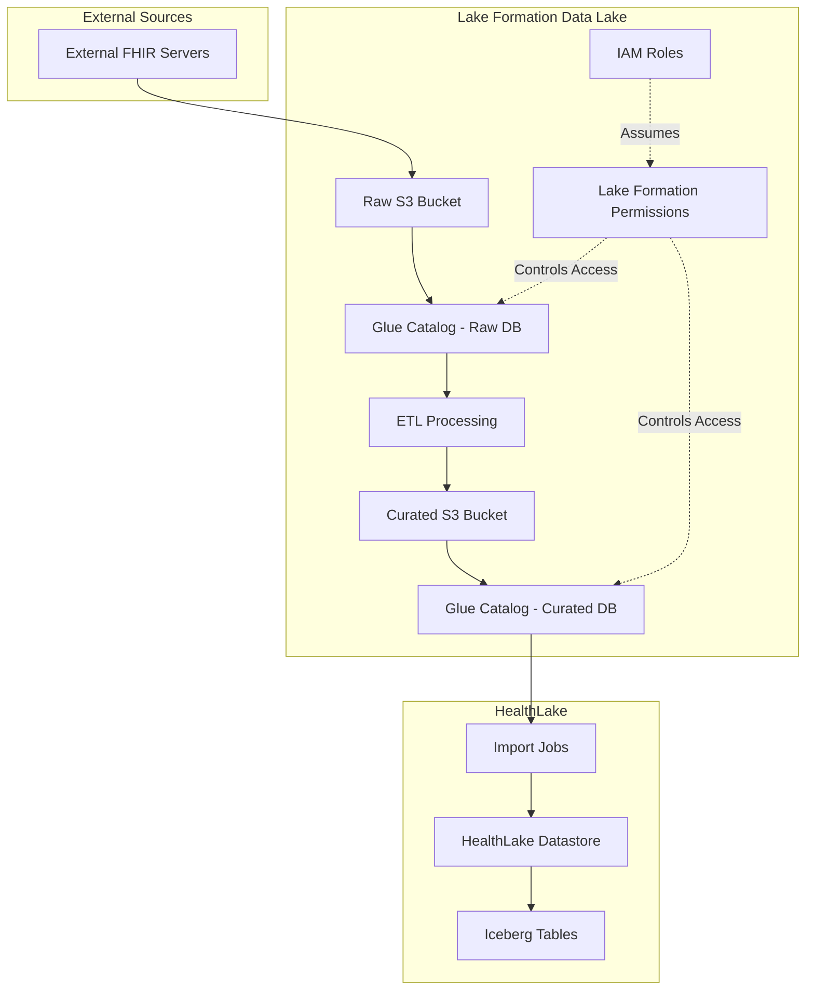

# Lake Formation Stack

## Overview

The Lake Formation stack provides a comprehensive data lake infrastructure for managing external FHIR data before importing it into AWS HealthLake. It implements a multi-tenant architecture with fine-grained access control, data governance, and ETL pipeline support.

## Architecture



## Stack Components

### 1. DataLakeStorageStack
**File**: `Stacks/DataLakeStorageStack.cs`

Creates the S3 buckets for data storage:
- **Raw Data Bucket**: Stores unprocessed FHIR data from external sources
- **Curated Data Bucket**: Stores processed FHIR data ready for HealthLake import
- **PHI Data Bucket** (Optional): Additional bucket for sensitive PHI data with enhanced security

Features:
- Server-side encryption (AES256)
- Versioning enabled
- Lifecycle policies for cost optimization
- Block public access
- Cross-region replication support (optional)

### 2. LakeFormationSetupStack
**File**: `Stacks/LakeFormationSetupStack.cs`

Sets up the Lake Formation governance layer:

#### Glue Databases
- **`external_fhir_raw`**: Catalog for raw FHIR data
- **`external_fhir_curated`**: Catalog for processed FHIR data
- **`fhir_import_metadata_<env>`**: Metadata and audit tracking

#### IAM Roles
- **Lake Formation Admin Role**: Full Lake Formation management permissions
- **Data Engineer Role**: Read/write access for ETL processing
- **Data Analyst Role**: Read-only access for analytics
- **ETL Execution Role**: For automated ETL jobs

#### Lake Formation Configuration
- Data lake administrators setup
- Default permissions configuration
- S3 location registration with Lake Formation
- Resource tagging for governance

### 3. LakeFormationPermissionsStack
**File**: `Stacks/LakeFormationPermissionsStack.cs`

Manages fine-grained permissions:
- Database-level permissions
- Table-level permissions
- Column-level permissions (for PII/PHI protection)
- Tag-based access control (TBAC) for multi-tenancy

### 4. HealthLakeIntegrationStack (Deprecated)
**File**: `Stacks/HealthLakeIntegrationStack.cs.deprecated`

Note: This stack has been moved to the DataPipeline solution. HealthLake now creates its own Glue catalog with Iceberg tables after import.

## Configuration

### Environment Configuration
**File**: `lakeformation-config.json`

```json
{
  "environments": {
    "development": {
      "environment": "Development",
      "accountId": "615299752206",
      "region": "us-east-2",
      "healthLake": {
        "datastoreId": "",
        "enableMultiTenancy": true,
        "tenantClaimSystem": "http://thirdopinion.io/identity/claims/tenant"
      },
      "bucketConfig": {
        "rawBucketName": "dev-lf-raw-data-ue2",
        "curatedBucketName": "dev-lf-curated-data-ue2"
      }
    }
  }
}
```

### Deployment Configuration
Configure via environment variables or command-line arguments:

```bash
# Deploy Lake Formation stacks
CDK_STACK_TYPE=LAKEFORMATION dotnet run -- --app=LakeFormation --environment=Development

# Or use environment variables
export CDK_ENVIRONMENT=Development
export CDK_APPLICATION=LakeFormation
dotnet run
```

## Data Flow

### 1. Data Ingestion
External FHIR data is extracted and stored in the raw S3 bucket:
```
s3://raw-bucket/raw/
  └── tenantGuid=<guid>/
      └── source_system=<system>/
          └── import_date=2024-01-15/
              ├── Patient.ndjson
              ├── Observation.ndjson
              └── Condition.ndjson
```

### 2. ETL Processing
Lambda functions or Glue jobs process the raw data:
- Add tenant security labels
- Validate FHIR resources
- Clean and transform data
- Handle errors and duplicates

### 3. Curated Data
Processed data is stored in the curated bucket:
```
s3://curated-bucket/curated/
  └── tenantGuid=<guid>/
      └── import_date=2024-01-15/
          ├── Patient-processed.ndjson
          ├── Observation-processed.ndjson
          └── Condition-processed.ndjson
```

### 4. HealthLake Import
The curated data is imported into HealthLake using the StartFHIRImportJob API.

## Multi-Tenant Support

### Tenant Isolation
- Data partitioned by `tenantGuid` at the S3 level
- Security labels added to FHIR resources:
```json
{
  "meta": {
    "security": [{
      "system": "http://thirdopinion.io/identity/claims/tenant",
      "code": "tenant-guid-here"
    }]
  }
}
```

### Access Control
- Lake Formation tag-based access control (TBAC)
- IAM policies with tenant conditions
- Separate Glue catalog permissions per tenant

## Security Features

### Encryption
- S3 server-side encryption (SSE-S3)
- Option for KMS encryption for PHI data
- Encryption in transit via HTTPS

### Access Control
- Lake Formation permissions model
- IAM role-based access
- S3 bucket policies
- VPC endpoints for private access

### Audit & Compliance
- CloudTrail logging for all API calls
- S3 access logging
- Lake Formation audit logs
- Data lineage tracking

## Monitoring & Alerting

### CloudWatch Metrics
- S3 bucket metrics (size, request count)
- Glue job metrics (success/failure rates)
- Lake Formation query metrics

### Alarms
- ETL job failures
- S3 bucket size thresholds
- Permission denied events
- Data quality issues

## Deployment

### Prerequisites
1. AWS CDK installed
2. .NET 8.0 SDK
3. AWS credentials configured
4. Appropriate IAM permissions

### Deploy All Stacks
```bash
# Deploy to development
AWS_PROFILE=to-dev-admin npx cdk deploy dev-lf-* --app "dotnet run -- --app=LakeFormation --environment=Development"

# Deploy to production
AWS_PROFILE=to-prd-admin npx cdk deploy prod-lf-* --app "dotnet run -- --app=LakeFormation --environment=Production"
```

### Deploy Individual Stacks
```bash
# Storage stack
AWS_PROFILE=to-dev-admin npx cdk deploy dev-lf-storage-ue2

# Setup stack
AWS_PROFILE=to-dev-admin npx cdk deploy dev-lf-setup-ue2

# Permissions stack
AWS_PROFILE=to-dev-admin npx cdk deploy dev-lf-permissions-ue2
```

## Testing

### Verify Deployment
```bash
# Check S3 buckets
aws s3 ls --profile to-dev-admin

# Check Glue databases
aws glue get-databases --profile to-dev-admin

# Check Lake Formation permissions
aws lakeformation list-permissions --profile to-dev-admin
```

### Test Data Flow
1. Upload test FHIR data to raw bucket
2. Trigger ETL processing
3. Verify data in curated bucket
4. Import to HealthLake
5. Query via Athena

## Troubleshooting

### Common Issues

#### 1. Permission Denied
- Check Lake Formation permissions
- Verify IAM role policies
- Ensure S3 bucket policies allow access

#### 2. ETL Job Failures
- Check CloudWatch logs
- Verify data format (must be valid NDJSON)
- Ensure tenant labels are properly formatted

#### 3. HealthLake Import Failures
- Validate FHIR resources against HealthLake requirements
- Check for duplicate resource IDs
- Verify security labels format

## Cost Optimization

### S3 Storage
- Lifecycle policies to transition old data to Glacier
- Intelligent-Tiering for unpredictable access patterns
- Delete incomplete multipart uploads

### Compute
- Use Spot instances for ETL jobs where possible
- Right-size Lambda functions
- Schedule ETL jobs during off-peak hours

### Data Transfer
- Use VPC endpoints to avoid data transfer charges
- Compress data before storage
- Use S3 Transfer Acceleration for large uploads

## Future Enhancements

1. **Real-time Processing**
   - Kinesis Data Streams for real-time ingestion
   - Lambda triggers for immediate processing

2. **Advanced Analytics**
   - Integration with SageMaker for ML models
   - QuickSight dashboards for visualization

3. **Data Quality**
   - AWS Glue Data Quality rules
   - Automated data profiling

4. **Cross-Region Support**
   - Multi-region deployment
   - Cross-region replication

## Support

For issues or questions:
1. Check CloudWatch logs
2. Review this documentation
3. Contact the infrastructure team
4. File an issue in the repository

## Related Documentation

- [FHIR Data Flow Architecture](../../docs/fhir-data-flow-architecture.md)
- [AWS Lake Formation Documentation](https://docs.aws.amazon.com/lake-formation/)
- [AWS HealthLake Documentation](https://docs.aws.amazon.com/healthlake/)
- [FHIR Specification](https://www.hl7.org/fhir/)