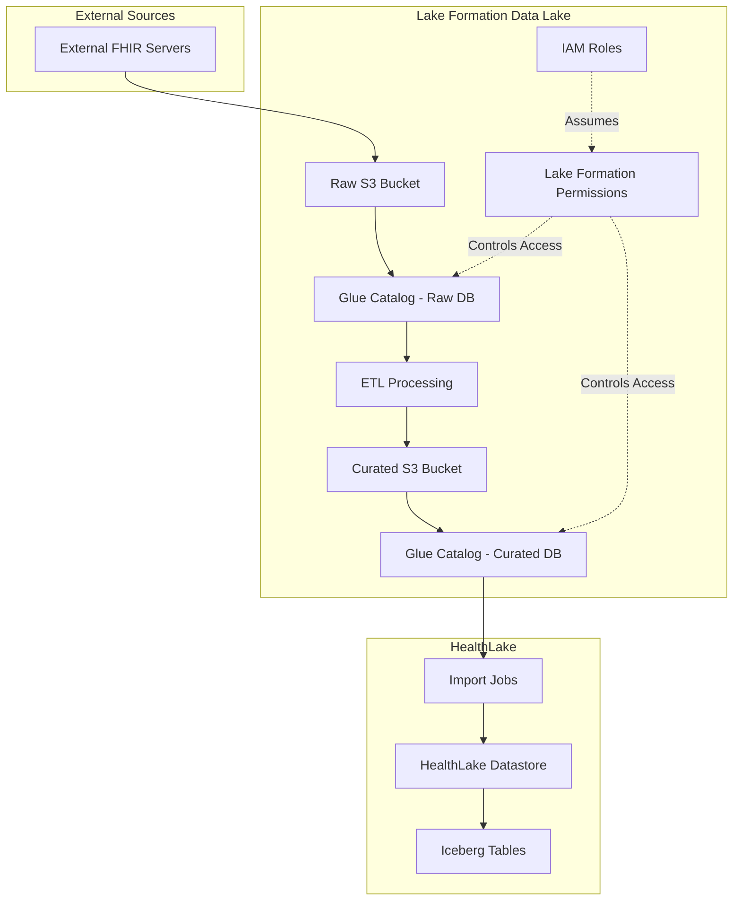
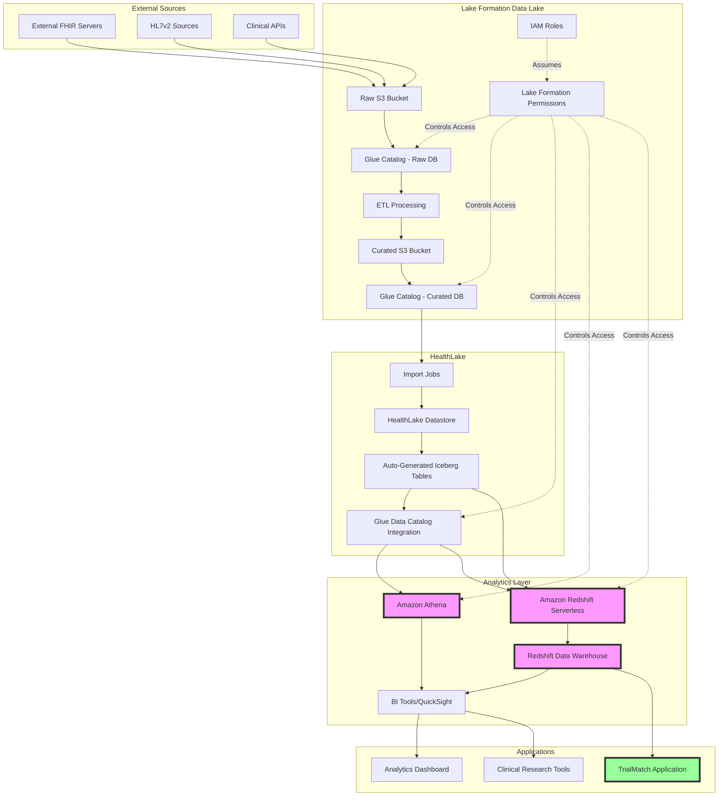

# Lake Formation Stack

## Overview

The Lake Formation stack provides a comprehensive data lake infrastructure for managing external FHIR data before importing it into AWS HealthLake. It implements a single-tenant-per-HealthLake-instance architecture where each HealthLake datastore is dedicated to a single customer/tenant, with fine-grained access control, data governance, and ETL pipeline support.

## Architecture

### Current State


### Future State (Analytics Platform)


### Future State Components

#### Analytics Services (Coming Soon)

##### Amazon Athena
- **Purpose**: Serverless SQL queries directly on HealthLake Iceberg tables
- **Use Cases**: 
  - Ad-hoc analysis of FHIR data
  - Quick exploratory data analysis
  - Direct queries on auto-generated Iceberg tables from HealthLake
- **Benefits**:
  - No infrastructure to manage
  - Pay only for queries run
  - Direct integration with Lake Formation permissions

##### Amazon Redshift Serverless
- **Purpose**: ETL processing and data transformation from HealthLake
- **Capabilities**:
  - Read directly from HealthLake Iceberg tables via Glue Data Catalog
  - Transform FHIR data into analytical formats
  - Create materialized views for performance
- **Integration**: Native support for Apache Iceberg format

##### Redshift Data Warehouse
- **Purpose**: Central analytics warehouse for TrialMatch and other applications
- **Features**:
  - Optimized analytical schemas (star/snowflake)
  - Pre-aggregated data for fast queries
  - Historical data retention
  - Cross-tenant analytics (with proper isolation)
- **Data Sources**:
  - ETL from HealthLake via Redshift Serverless
  - Direct loads from curated S3 buckets
  - Real-time streams from clinical systems

#### Data Flow in Future Architecture

1. **Ingestion**: Multiple data sources (FHIR, HL7v2, APIs) → Raw S3
2. **Processing**: ETL via Glue/Lambda → Curated S3
3. **HealthLake Import**: Curated data → HealthLake datastore
4. **Catalog Generation**: HealthLake automatically creates Iceberg tables in Glue Catalog
5. **Analytics Access**:
   - Athena queries Iceberg tables directly for ad-hoc analysis
   - Redshift Serverless reads Iceberg tables for ETL
   - Redshift DW stores transformed data for applications
6. **Application Layer**: TrialMatch and other apps query Redshift DW

#### Benefits of Future Architecture

1. **Unified Data Platform**: Single source of truth with HealthLake
2. **Flexible Analytics**: Choose the right tool for each use case
3. **Cost Optimization**: Serverless options reduce idle costs
4. **Performance**: Redshift provides sub-second queries for applications
5. **Governance**: Lake Formation provides unified access control
6. **Scalability**: Each component scales independently

## Stack Components

### 1. DataLakeStorageStack
**File**: `Stacks/DataLakeStorageStack.cs`

Creates the S3 buckets for data storage:
- **Raw Data Bucket**: Stores unprocessed FHIR data from external sources
- **Curated Data Bucket**: Stores processed FHIR data ready for HealthLake import
- **PHI Data Bucket** (Optional): Additional bucket for sensitive PHI data with enhanced security

Features:
- Server-side encryption (AES256)
- Versioning enabled
- Lifecycle policies for cost optimization
- Block public access
- Cross-region replication support (optional)

### 2. LakeFormationSetupStack
**File**: `Stacks/LakeFormationSetupStack.cs`

Sets up the Lake Formation governance layer:

#### Glue Databases
- **`external_fhir_raw`**: Catalog for raw FHIR data
- **`external_fhir_curated`**: Catalog for processed FHIR data
- **`fhir_import_metadata_<env>`**: Metadata and audit tracking

#### IAM Roles
- **Lake Formation Admin Role**: Full Lake Formation management permissions
- **Data Engineer Role**: Read/write access for ETL processing
- **Data Analyst Role**: Read-only access for analytics
- **ETL Execution Role**: For automated ETL jobs

#### Lake Formation Configuration
- Data lake administrators setup
- Default permissions configuration
- S3 location registration with Lake Formation
- Resource tagging for governance

### 3. LakeFormationPermissionsStack
**File**: `Stacks/LakeFormationPermissionsStack.cs`

Manages fine-grained permissions:
- Database-level permissions
- Table-level permissions
- Column-level permissions (for PII/PHI protection)
- Tag-based access control (TBAC) for multi-tenancy

### 4. HealthLakeIntegrationStack (Deprecated)
**File**: `Stacks/HealthLakeIntegrationStack.cs.deprecated`

Note: This stack has been moved to the DataPipeline solution. HealthLake now creates its own Glue catalog with Iceberg tables after import.

## Configuration

### Environment Configuration
**File**: `lakeformation-config.json`

The Lake Formation configuration file provides environment-specific settings for data lake infrastructure, group mappings, and security policies.

#### Configuration Structure

```json
{
  "environments": {
    "<environment-name>": {
      "environment": "Development|Production",
      "accountId": "aws-account-id",
      "region": "aws-region",
      "identityCenter": {
        "instanceArn": "arn:aws:sso:::instance/<instance-id>",
        "identityStoreId": "<identity-store-id>",
        "identityCenterAccountId": "<management-account-id>"
      },
      "healthLake": {
        "datastoreId": "<datastore-id>",
        "datastoreArn": "<datastore-arn>", 
        "enableMultiTenancy": true|false,
        "tenantClaimSystem": "http://thirdopinion.io/identity/claims/tenant"
      },
      "bucketConfig": {
        "bucketPrefix": "thirdopinion",
        "enableVersioning": true|false,
        "enableEncryption": true|false,
        "enableAccessLogging": true|false,
        "enableMultiTenantStructure": true|false,
        "tenantPartitionKey": "tenantGuid",
        "lifecycle": {
          "transitionToIADays": 90,
          "transitionToGlacierDays": 180,
          "expirationDays": 0,
          "enableIntelligentTiering": true|false
        }
      },
      "groupMappings": {
        "<group-name>": {
          "groupName": "<group-name>",
          "groupEmail": "<group-email>",
          "description": "<group-description>",
          "permissions": ["SELECT", "DESCRIBE", "ALL", ...],
          "allowedDatabases": ["<database-name>", "*"],
          "allowedTables": ["<table-name>", "*"],
          "excludePHI": true|false,
          "isDataLakeAdmin": true|false
        }
      },
      "tags": {
        "Environment": "<environment>",
        "Project": "ThirdOpinionDataLake",
        "ManagedBy": "CDK",
        "Owner": "DataEngineering",
        "Compliance": "HIPAA"
      }
    }
  }
}
```

#### Complete Configuration Examples

##### Development Environment
```json
{
  "environments": {
    "development": {
      "environment": "Development",
      "accountId": "615299752206",
      "region": "us-east-2",
      "identityCenter": {
        "instanceArn": "arn:aws:sso:::instance/ssoins-66849025a110d385",
        "identityStoreId": "d-9a677c3adb",
        "identityCenterAccountId": "442042533707"
      },
      "healthLake": {
        "datastoreId": "",
        "datastoreArn": "",
        "enableMultiTenancy": true,
        "tenantClaimSystem": "http://thirdopinion.io/identity/claims/tenant"
      },
      "bucketConfig": {
        "bucketPrefix": "thirdopinion",
        "enableVersioning": true,
        "enableEncryption": true,
        "enableAccessLogging": true,
        "enableMultiTenantStructure": true,
        "tenantPartitionKey": "tenantGuid",
        "lifecycle": {
          "transitionToIADays": 90,
          "transitionToGlacierDays": 180,
          "expirationDays": 0,
          "enableIntelligentTiering": true
        }
      },
      "groupMappings": {
        "data-analysts-dev": {
          "groupName": "data-analysts-dev",
          "groupEmail": "data-analysts-dev@thirdopinion.io",
          "description": "Development data analysts with non-PHI access",
          "permissions": ["SELECT", "DESCRIBE"],
          "allowedDatabases": ["thirdopinion_dev", "thirdopinion_staging"],
          "allowedTables": ["*"],
          "excludePHI": true,
          "isDataLakeAdmin": false
        },
        "data-engineers-dev": {
          "groupName": "data-engineers-dev",
          "groupEmail": "data-engineers-dev@thirdopinion.io",
          "description": "Development data engineers",
          "permissions": ["ALL"],
          "allowedDatabases": ["thirdopinion_dev", "thirdopinion_staging"],
          "allowedTables": ["*"],
          "excludePHI": false,
          "isDataLakeAdmin": true
        }
      },
      "tags": {
        "Environment": "Development",
        "Project": "ThirdOpinionDataLake",
        "ManagedBy": "CDK",
        "Owner": "DataEngineering"
      }
    }
  }
}
```

##### Production Environment
```json
{
  "environments": {
    "production": {
      "environment": "Production",
      "accountId": "442042533707",
      "region": "us-east-2",
      "identityCenter": {
        "instanceArn": "arn:aws:sso:::instance/ssoins-66849025a110d385",
        "identityStoreId": "d-9a677c3adb",
        "identityCenterAccountId": "442042533707"
      },
      "healthLake": {
        "datastoreId": "",
        "datastoreArn": "",
        "enableMultiTenancy": true,
        "tenantClaimSystem": "http://thirdopinion.io/identity/claims/tenant"
      },
      "bucketConfig": {
        "bucketPrefix": "thirdopinion",
        "enableVersioning": true,
        "enableEncryption": true,
        "enableAccessLogging": true,
        "enableMultiTenantStructure": true,
        "tenantPartitionKey": "tenantGuid",
        "lifecycle": {
          "transitionToIADays": 90,
          "transitionToGlacierDays": 180,
          "expirationDays": 0,
          "enableIntelligentTiering": true
        }
      },
      "groupMappings": {
        "data-analysts-phi": {
          "groupName": "data-analysts-phi",
          "groupEmail": "data-analysts-phi@thirdopinion.io",
          "description": "Data analysts with PHI access",
          "permissions": ["SELECT", "DESCRIBE"],
          "allowedDatabases": ["thirdopinion_prod", "thirdopinion_phi"],
          "allowedTables": ["*"],
          "excludePHI": false,
          "isDataLakeAdmin": false
        },
        "data-engineers-phi": {
          "groupName": "data-engineers-phi",
          "groupEmail": "data-engineers-phi@thirdopinion.io",
          "description": "Data engineers with full PHI access",
          "permissions": ["ALL"],
          "allowedDatabases": ["*"],
          "allowedTables": ["*"],
          "excludePHI": false,
          "isDataLakeAdmin": true
        }
      },
      "tags": {
        "Environment": "Production",
        "Project": "ThirdOpinionDataLake",
        "ManagedBy": "CDK",
        "Owner": "DataEngineering",
        "Compliance": "HIPAA"
      }
    }
  }
}
```

#### Configuration Field Reference

##### Environment Settings
| Field | Type | Required | Description |
|-------|------|----------|-------------|
| `environment` | string | ✅ | Environment name (Development, Production) |
| `accountId` | string | ✅ | AWS account ID where resources will be deployed |
| `region` | string | ✅ | AWS region for deployment (default: us-east-2) |

##### Identity Center Configuration
| Field | Type | Required | Description |
|-------|------|----------|-------------|
| `instanceArn` | string | ✅ | AWS SSO/Identity Center instance ARN |
| `identityStoreId` | string | ✅ | Identity store ID for user/group management |
| `identityCenterAccountId` | string | ✅ | Account ID where Identity Center is hosted |

##### HealthLake Configuration
| Field | Type | Required | Description |
|-------|------|----------|-------------|
| `datastoreId` | string | ✅ | HealthLake datastore ID for this tenant |
| `datastoreArn` | string | ❌ | HealthLake datastore ARN (populated after creation) |
| `tenantId` | string | ✅ | GUID identifier for this single tenant |
| `tenantName` | string | ✅ | Human-readable name for the tenant/customer |
| `enableSampleData` | boolean | ✅ | Load sample FHIR data for testing |
| `markAsPHI` | boolean | ✅ | Mark sample data as PHI (for prod testing) |

##### Bucket Configuration
| Field | Type | Required | Description |
|-------|------|----------|-------------|
| `bucketPrefix` | string | ✅ | Prefix for S3 bucket names |
| `enableVersioning` | boolean | ✅ | Enable S3 bucket versioning |
| `enableEncryption` | boolean | ✅ | Enable S3 server-side encryption |
| `enableAccessLogging` | boolean | ✅ | Enable S3 access logging |
| `singleTenantId` | string | ✅ | GUID for the single tenant using this infrastructure |

##### Lifecycle Configuration
| Field | Type | Required | Description |
|-------|------|----------|-------------|
| `transitionToIADays` | number | ✅ | Days to transition to Infrequent Access |
| `transitionToGlacierDays` | number | ✅ | Days to transition to Glacier |
| `expirationDays` | number | ✅ | Days to expire objects (0 = never expire) |
| `enableIntelligentTiering` | boolean | ✅ | Enable S3 Intelligent Tiering |

##### Group Mappings
| Field | Type | Required | Description |
|-------|------|----------|-------------|
| `groupName` | string | ✅ | Identity Center group name |
| `groupEmail` | string | ✅ | Group email address |
| `description` | string | ✅ | Human-readable group description |
| `permissions` | string[] | ✅ | Lake Formation permissions (SELECT, DESCRIBE, ALL, etc.) |
| `allowedDatabases` | string[] | ✅ | Databases group can access (* for all) |
| `allowedTables` | string[] | ✅ | Tables group can access (* for all) |
| `excludePHI` | boolean | ✅ | Whether to exclude PHI data access |
| `isDataLakeAdmin` | boolean | ✅ | Whether group has Lake Formation admin privileges |

##### Tags Configuration
| Field | Type | Required | Description |
|-------|------|----------|-------------|
| `Environment` | string | ✅ | Environment tag for resource organization |
| `Project` | string | ✅ | Project identifier |
| `ManagedBy` | string | ✅ | Management system (CDK) |
| `Owner` | string | ✅ | Owning team/department |
| `Compliance` | string | ❌ | Compliance framework (HIPAA for production) |

#### Permission Levels

##### Data Analyst Permissions
- **Development**: `SELECT`, `DESCRIBE` with PHI exclusion
- **Production**: `SELECT`, `DESCRIBE` with PHI access for authorized groups

##### Data Engineer Permissions  
- **Development**: `ALL` permissions for development flexibility
- **Production**: `ALL` permissions with strict PHI controls

##### Available Lake Formation Permissions
- `SELECT`: Query data from tables
- `INSERT`: Add new data to tables
- `UPDATE`: Modify existing data
- `DELETE`: Remove data from tables
- `DESCRIBE`: View metadata and schema
- `CREATE_TABLE`: Create new tables
- `ALTER`: Modify table structure
- `DROP`: Delete tables
- `ALL`: All available permissions

#### Multi-Environment Support

The configuration supports multiple environments with different security postures:

- **Development**: Broader access, PHI exclusion by default, development-friendly policies
- **Production**: Strict HIPAA-compliant access controls, PHI access for authorized groups only
- **Staging/UAT**: Can be configured with production-like restrictions for testing

#### Security Considerations

1. **PHI Exclusion**: Development groups automatically exclude PHI data access
2. **Admin Privileges**: Only designated groups have Lake Formation admin access
3. **Database Isolation**: Groups can be restricted to specific databases
4. **Audit Logging**: All configuration changes are tracked through Git
5. **Environment Separation**: Separate configurations prevent cross-environment access

### Deployment Configuration
Configure via environment variables or command-line arguments:

```bash
# Deploy Lake Formation stacks
CDK_STACK_TYPE=LAKEFORMATION dotnet run -- --app=LakeFormation --environment=Development

# Or use environment variables
export CDK_ENVIRONMENT=Development
export CDK_APPLICATION=LakeFormation
dotnet run
```

## Data Flow

### 1. Data Ingestion
External FHIR data is extracted and stored in the raw S3 bucket for a single tenant:
```
s3://raw-bucket/tenant_<guid>/raw/
  └── source_system=<system>/
      └── import_date=2024-01-15/
          ├── Patient.ndjson
          ├── Observation.ndjson
          └── Condition.ndjson
```

### 2. ETL Processing
Lambda functions or Glue jobs process the raw data:
- Validate FHIR resources
- Clean and transform data
- Handle errors and duplicates
- Organize by tenant at the S3 path level

### 3. Curated Data
Processed data is stored in the curated bucket for the single tenant:
```
s3://curated-bucket/tenant_<guid>/curated/
  └── import_date=2024-01-15/
      ├── Patient-processed.ndjson
      ├── Observation-processed.ndjson
      └── Condition-processed.ndjson
```

### 4. HealthLake Import
The curated data is imported into HealthLake using the StartFHIRImportJob API.

## Single-Tenant Architecture

### Tenant Isolation
- Each HealthLake instance is dedicated to a single tenant/customer
- Data organized by tenant GUID at the S3 level: `s3://bucket/tenant_{tenantId}/`
- Glue databases include tenant ID in naming: `fhir_raw_{shortTenantId}_{environment}`
- HealthLake datastores are tagged with tenant ID and PHI status
- No security labels added to individual FHIR resources (labels applied at datastore level)

### Access Control
- Lake Formation tag-based access control using tenant GUID
- IAM policies scoped to single tenant
- Dedicated Glue catalog databases per tenant
- HealthLake datastore dedicated to single customer

## Security Features

### Encryption
- S3 server-side encryption (SSE-S3)
- Option for KMS encryption for PHI data
- Encryption in transit via HTTPS

### Access Control
- Lake Formation permissions model
- IAM role-based access
- S3 bucket policies
- VPC endpoints for private access

### Audit & Compliance
- CloudTrail logging for all API calls
- S3 access logging
- Lake Formation audit logs
- Data lineage tracking

## Monitoring & Alerting

### CloudWatch Metrics
- S3 bucket metrics (size, request count)
- Glue job metrics (success/failure rates)
- Lake Formation query metrics

### Alarms
- ETL job failures
- S3 bucket size thresholds
- Permission denied events
- Data quality issues

## Deployment

### Prerequisites
1. AWS CDK installed
2. .NET 8.0 SDK
3. AWS credentials configured
4. Appropriate IAM permissions

### Deploy All Stacks
```bash
# Deploy to development
AWS_PROFILE=to-dev-admin npx cdk deploy dev-lf-* --app "dotnet run -- --app=LakeFormation --environment=Development"

# Deploy to production
AWS_PROFILE=to-prd-admin npx cdk deploy prod-lf-* --app "dotnet run -- --app=LakeFormation --environment=Production"
```

### Deploy Individual Stacks
```bash
# Storage stack
AWS_PROFILE=to-dev-admin npx cdk deploy dev-lf-storage-ue2

# Setup stack
AWS_PROFILE=to-dev-admin npx cdk deploy dev-lf-setup-ue2

# Permissions stack
AWS_PROFILE=to-dev-admin npx cdk deploy dev-lf-permissions-ue2
```

## Testing

### Permission Validation Tools

Comprehensive validation tools are available to test Lake Formation permissions and compliance:

#### Bash Validation Script
```bash
# Development environment validation
./tools/AppInfraCdkV1.Tools.Common/scripts/validate-lakeformation-permissions.sh Development to-dev-admin

# Production environment validation
./tools/AppInfraCdkV1.Tools.Common/scripts/validate-lakeformation-permissions.sh Production to-prd-admin
```

#### PowerShell Validation Script (Windows)
```powershell
# Development validation with PHI testing
.\tools\AppInfraCdkV1.Tools.Common\scripts\validate-lakeformation-permissions.ps1 -Environment "Development" -Profile "to-dev-admin"

# Production validation with full compliance reporting
.\tools\AppInfraCdkV1.Tools.Common\scripts\validate-lakeformation-permissions.ps1 -Environment "Production" -Profile "to-prd-admin"
```

#### Validation Coverage
The validation scripts test:
- ✅ Lake Formation setup and configuration
- ✅ LF-Tags creation and values (PHI, TenantID, DataType, etc.)
- ✅ Identity Center group permissions
- ✅ PHI access control enforcement
- ✅ DevOps role access denial
- ✅ Tenant isolation capabilities
- ✅ Database access patterns
- ✅ HIPAA compliance readiness
- ✅ Multi-tenant security boundaries

#### Validation Reports
Scripts generate detailed JSON compliance reports:
```json
{
  "validation_report": {
    "environment": "Production",
    "account_id": "442042533707", 
    "summary": {
      "total_tests": 25,
      "passed_tests": 25,
      "success_rate": "100%"
    },
    "compliance_status": {
      "hipaa_ready": true,
      "multi_tenant_ready": true
    }
  }
}
```

### Verify Deployment
```bash
# Check S3 buckets
aws s3 ls --profile to-dev-admin

# Check Glue databases
aws glue get-databases --profile to-dev-admin

# Check Lake Formation permissions
aws lakeformation list-permissions --profile to-dev-admin

# Validate LF-Tags
aws lakeformation list-lf-tags --profile to-dev-admin

# Check Identity Center groups
aws identitystore list-groups --identity-store-id d-9a677c3adb --profile to-dev-admin
```

### Test Data Flow
1. Upload test FHIR data to raw bucket
2. Trigger ETL processing
3. Verify data in curated bucket
4. Import to HealthLake
5. Query via Athena

### CI/CD Integration
Add validation to GitHub Actions workflows:
```yaml
- name: Validate Lake Formation Permissions
  run: |
    ./tools/AppInfraCdkV1.Tools.Common/scripts/validate-lakeformation-permissions.sh \
      ${{ env.ENVIRONMENT }} ${{ env.AWS_PROFILE }}
  env:
    VALIDATE_PHI_ACCESS: true
    VALIDATE_DEVOPS_DENIAL: true
    GENERATE_COMPLIANCE_REPORT: true
```

## Troubleshooting

### Common Issues

#### 1. Permission Denied
- Check Lake Formation permissions
- Verify IAM role policies
- Ensure S3 bucket policies allow access

#### 2. ETL Job Failures
- Check CloudWatch logs
- Verify data format (must be valid NDJSON)
- Ensure tenant labels are properly formatted

#### 3. HealthLake Import Failures
- Validate FHIR resources against HealthLake requirements
- Check for duplicate resource IDs
- Verify security labels format

## Cost Optimization

### S3 Storage
- Lifecycle policies to transition old data to Glacier
- Intelligent-Tiering for unpredictable access patterns
- Delete incomplete multipart uploads

### Compute
- Use Spot instances for ETL jobs where possible
- Right-size Lambda functions
- Schedule ETL jobs during off-peak hours

### Data Transfer
- Use VPC endpoints to avoid data transfer charges
- Compress data before storage
- Use S3 Transfer Acceleration for large uploads

## Future Enhancements

1. **Real-time Processing**
   - Kinesis Data Streams for real-time ingestion
   - Lambda triggers for immediate processing

2. **Advanced Analytics**
   - Integration with SageMaker for ML models
   - QuickSight dashboards for visualization

3. **Data Quality**
   - AWS Glue Data Quality rules
   - Automated data profiling

4. **Cross-Region Support**
   - Multi-region deployment
   - Cross-region replication

## Support

For issues or questions:
1. Check CloudWatch logs
2. Review this documentation
3. Contact the infrastructure team
4. File an issue in the repository

## Related Documentation

- [FHIR Data Flow Architecture](../../docs/fhir-data-flow-architecture.md)
- [AWS Lake Formation Documentation](https://docs.aws.amazon.com/lake-formation/)
- [AWS HealthLake Documentation](https://docs.aws.amazon.com/healthlake/)
- [FHIR Specification](https://www.hl7.org/fhir/)