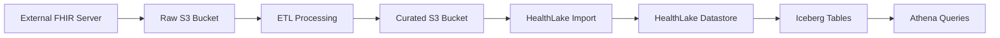

# FHIR Data Flow Architecture

## Overview
This document describes the data flow architecture for importing external FHIR data into AWS HealthLake with multi-tenant support.

## Data Flow Pipeline



## Glue Database Organization

### 1. External FHIR Raw (`external_fhir_raw`)
- **Purpose**: Stores raw FHIR data pulled from external FHIR servers
- **Format**: NDJSON (Newline Delimited JSON)
- **Location**: `s3://<raw-bucket>/raw/`
- **Partitioning**: 
  - `tenantGuid`: Multi-tenant isolation
  - `source_system`: Identifies the source FHIR server
  - `import_date`: Date of data extraction
- **Example Tables**:
  - `external_fhir_raw.patient` - Raw patient resources
  - `external_fhir_raw.observation` - Raw observation resources
  - `external_fhir_raw.condition` - Raw condition resources

### 2. External FHIR Curated (`external_fhir_curated`)
- **Purpose**: Processed FHIR data ready for HealthLake import
- **Format**: NDJSON with tenant security labels added
- **Location**: `s3://<curated-bucket>/curated/`
- **Partitioning**:
  - `tenantGuid`: Multi-tenant isolation
  - `import_date`: Date ready for import
- **Processing Applied**:
  - Tenant security labels added to `meta.security`
  - Data validation and cleansing
  - FHIR resource compliance checks
  - Deduplication
- **Example Tables**:
  - `external_fhir_curated.patient` - Processed patient resources
  - `external_fhir_curated.observation` - Processed observation resources

### 3. FHIR Import Metadata (`fhir_import_metadata_<env>`)
- **Purpose**: Tracks ETL jobs and import history
- **Format**: Parquet with Snappy compression
- **Location**: `s3://<raw-bucket>/metadata/`
- **Tables**:
  - `import_jobs` - ETL job execution history
  - `import_errors` - Failed records and error details
  - `import_metrics` - Performance and volume metrics

### 4. HealthLake Native Catalog (Auto-Created)
- **Note**: HealthLake automatically creates its own Glue catalog after data import
- **Format**: Apache Iceberg tables
- **Features**:
  - ACID transactions
  - Time travel queries
  - Schema evolution
  - Efficient updates and deletes
- **Database Name**: Determined by HealthLake (typically includes datastore ID)
- **Example Tables**:
  - Auto-created tables for each FHIR resource type
  - Optimized for analytical queries via Athena

## ETL Processing Steps

### Step 1: Extract from External FHIR Server
```python
# Data lands in external_fhir_raw database
s3://raw-bucket/raw/
  └── tenantGuid=<guid>/
      └── source_system=<system>/
          └── import_date=2024-01-15/
              ├── Patient.ndjson
              ├── Observation.ndjson
              └── Condition.ndjson
```

### Step 2: Process and Add Tenant Labels
```python
# ETL adds tenant security labels
# Data moves to external_fhir_curated database
s3://curated-bucket/curated/
  └── tenantGuid=<guid>/
      └── import_date=2024-01-15/
          ├── Patient-processed.ndjson
          ├── Observation-processed.ndjson
          └── Condition-processed.ndjson
```

### Step 3: Import to HealthLake
```python
# Use AWS HealthLake StartFHIRImportJob API
# HealthLake reads from curated bucket
# Creates Iceberg tables automatically
```

## Security Label Format
Each FHIR resource in the curated layer includes tenant identification:

```json
{
  "resourceType": "Patient",
  "id": "example-123",
  "meta": {
    "security": [
      {
        "system": "http://thirdopinion.io/identity/claims/tenant",
        "code": "tenant-guid-here"
      }
    ]
  },
  ...
}
```

## Benefits of This Architecture

1. **Clear Separation of Concerns**
   - Raw layer preserves original data
   - Curated layer ensures HealthLake compatibility
   - HealthLake manages its own optimized storage

2. **Multi-Tenant Support**
   - Tenant isolation at every layer
   - Security labels enable HealthLake tenant filtering
   - Partition-based access control in Lake Formation

3. **Data Lineage**
   - Track data from source through to HealthLake
   - Metadata database maintains audit trail
   - Easy troubleshooting of import issues

4. **Performance Optimization**
   - HealthLake's Iceberg tables provide optimal query performance
   - ACID transactions for data consistency
   - Automatic optimization by HealthLake

5. **Flexibility**
   - Support multiple source systems
   - Easy to add new FHIR resource types
   - Can reprocess historical data if needed

## Lake Formation Permissions

### Raw Database Access
- **Data Engineers**: Read/Write to process data
- **ETL Role**: Read access for processing

### Curated Database Access
- **Data Engineers**: Read/Write for import preparation
- **HealthLake Import Role**: Read access for import jobs
- **Data Analysts**: Read access for validation

### HealthLake Catalog Access
- **Data Analysts**: Query access via Athena
- **Applications**: API access through HealthLake endpoints
- **Reporting Tools**: Read access for analytics

## Next Steps

1. Implement ETL Lambda functions for processing
2. Set up EventBridge rules for automated processing
3. Configure HealthLake import jobs
4. Create Athena views for common queries
5. Set up monitoring and alerting